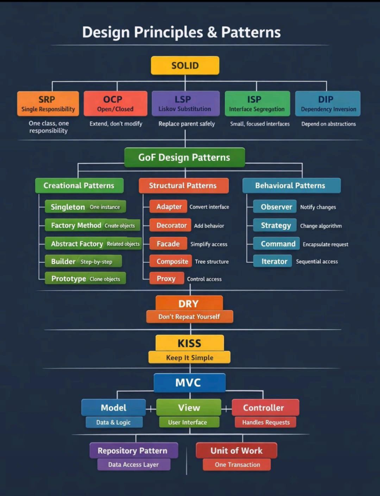

# 1) Modern Spring Boot REST API Architecture

Controller (API Layer)  
&nbsp;&nbsp;&nbsp;&nbsp;↓  
Service (Business Logic)  
&nbsp;&nbsp;&nbsp;&nbsp;↓  
Repository (JPA / Mongo / Reactive)  
&nbsp;&nbsp;&nbsp;&nbsp;↓  
Database  

---

### With:

- DTOs (no entity exposure)  
- Validation  
- Exception handling  
- Pagination + Sorting  
- OpenAPI (Swagger)  
- Security (JWT/OAuth2)  
- Observability (Actuator + Micrometer)  
- Cloud-ready config  

---

## ✅ 1. Project Setup (Spring Initializr)

### Dependencies (Modern Stack)

Select:

- Spring Web  
- Spring Data JPA  
- Spring Security  
- Validation  
- Spring Boot Actuator  
- Lombok  
- OpenAPI (springdoc)  
- PostgreSQL / MySQL Driver  
- MapStruct (Optional)  

---

## ✅ 2. REST Controller (Best Practice)

👉 **Never expose Entity directly.**

### `UserController.java`

```java
@RestController
@RequestMapping("/api/v1/users")
@RequiredArgsConstructor
public class UserController {

    private final UserService userService;

    @PostMapping
    public ResponseEntity<UserResponse> createUser(
            @Valid @RequestBody UserRequest request) {

        return ResponseEntity
                .status(HttpStatus.CREATED)
                .body(userService.createUser(request));
    }

    @GetMapping("/{id}")
    public ResponseEntity<UserResponse> getUser(@PathVariable Long id) {

        return ResponseEntity.ok(userService.getUser(id));
    }
}
````

---

## ✅ 3. DTO Layer (Modern Standard)

### Request DTO

```java
@Data
public class UserRequest {

    @NotBlank
    private String name;

    @Email
    private String email;
}
```

### Response DTO

```java
@Data
@AllArgsConstructor
public class UserResponse {

    private Long id;
    private String name;
    private String email;
}
```

---

## ✅ 4. Entity Layer (JPA Modern Style)

```java
@Entity
@Table(name = "users")
@Getter @Setter
public class User {

    @Id
    @GeneratedValue(strategy = GenerationType.IDENTITY)
    private Long id;

    @Column(nullable = false)
    private String name;

    @Column(unique = true)
    private String email;
}
```

---

## ✅ 5. Service Layer

### Interface First (Enterprise Standard)

```java
public interface UserService {

    UserResponse createUser(UserRequest request);

    UserResponse getUser(Long id);
}
```

### Implementation

```java
@Service
@RequiredArgsConstructor
@Transactional
public class UserServiceImpl implements UserService {

    private final UserRepository userRepository;

    @Override
    public UserResponse createUser(UserRequest request) {

        User user = new User();
        user.setName(request.getName());
        user.setEmail(request.getEmail());

        User saved = userRepository.save(user);

        return new UserResponse(
                saved.getId(),
                saved.getName(),
                saved.getEmail()
        );
    }

    @Override
    public UserResponse getUser(Long id) {

        User user = userRepository.findById(id)
                .orElseThrow(() -> new ResourceNotFoundException("User not found"));

        return new UserResponse(
                user.getId(),
                user.getName(),
                user.getEmail()
        );
    }
}
```

---

## ✅ 6. Repository Layer

```java
@Repository
public interface UserRepository extends JpaRepository<User, Long> {

    Optional<User> findByEmail(String email);
}
```

---

## ✅ 7. Global Exception Handling (VERY IMPORTANT)

### Centralized Error Handler

```java
@RestControllerAdvice
public class GlobalExceptionHandler {

    @ExceptionHandler(ResourceNotFoundException.class)
    public ResponseEntity<ApiError> handleNotFound(ResourceNotFoundException ex) {

        return ResponseEntity
                .status(HttpStatus.NOT_FOUND)
                .body(new ApiError(ex.getMessage()));
    }

    @ExceptionHandler(MethodArgumentNotValidException.class)
    public ResponseEntity<Map<String, String>> handleValidationErrors(
            MethodArgumentNotValidException ex) {

        Map<String, String> errors = new HashMap<>();

        ex.getBindingResult().getFieldErrors()
                .forEach(error ->
                        errors.put(error.getField(), error.getDefaultMessage()));

        return ResponseEntity.badRequest().body(errors);
    }
}
```

---

## ✅ 8. API Versioning (Modern Approach)

### URL Versioning (Most Used)

```
/api/v1/users
/api/v2/users
```

---

## ✅ 9. Pagination + Sorting (Enterprise Standard)

### Controller

```java
@GetMapping
public Page<UserResponse> getAllUsers(
        @RequestParam(defaultValue = "0") int page,
        @RequestParam(defaultValue = "10") int size) {

    return userService.getAllUsers(page, size);
}
```

### Service

```java
Pageable pageable = PageRequest.of(page, size, Sort.by("name"));

return userRepository.findAll(pageable)
        .map(user -> new UserResponse(...));
```

---

## ✅ 10. OpenAPI Swagger (Modern Replacement of Swagger2)

### Add Dependency

```
springdoc-openapi-starter-webmvc-ui
```

### Access UI

```
http://localhost:8080/swagger-ui.html
```

---

## ✅ 11. Security (JWT Modern Setup)

### Production Standard

* Spring Security 6
* JWT
* OAuth2 Resource Server
* Stateless

### Security Config

```java
@Bean
SecurityFilterChain securityFilterChain(HttpSecurity http) throws Exception {

    http
        .csrf(csrf -> csrf.disable())
        .authorizeHttpRequests(auth -> auth
                .requestMatchers("/swagger-ui/**").permitAll()
                .anyRequest().authenticated()
        )
        .oauth2ResourceServer(OAuth2ResourceServerConfigurer::jwt);

    return http.build();
}
```

---

## ✅ 12. Actuator + Monitoring (SRE Ready)

### Add

* spring-boot-starter-actuator
* micrometer-registry-prometheus

### Endpoints

```
/actuator/health
/actuator/metrics
/actuator/prometheus
```

### Used by

* Prometheus
* Grafana
* Alertmanager

---

## ✅ 13. Configuration Best Practices

### `application.yml`

```yaml
server:
  port: 8080

spring:
  datasource:
    url: jdbc:postgresql://localhost:5432/appdb
    username: app
    password: secret

  jpa:
    hibernate:
      ddl-auto: validate
    show-sql: false
```

---

## ✅ 14. Modern REST Standards

| Feature       | Standard       |
| ------------- | -------------- |
| Use DTO       | ✅ Mandatory    |
| Validation    | ✅ Yes          |
| HTTP Status   | ✅ Proper       |
| HATEOAS       | Optional       |
| Stateless     | ✅ Always       |
| Pagination    | ✅ Yes          |
| API Docs      | ✅ OpenAPI      |
| Observability | ✅ Actuator     |
| Security      | ✅ JWT / OAuth2 |

```
```

---


---

# 🔶 1. SOLID PRINCIPLES (DESIGN FOUNDATION)

> SOLID tells **how to design classes correctly**
> Patterns come **after** SOLID

---

## 🟧 SRP – Single Responsibility Principle

### Meaning

**One class = one responsibility**

### ❌ Bad

```java
class UserService {
    saveUser();
    sendEmail();
    generateReport();
}
```

### ✅ Good

```java
class UserService {
    saveUser();
}

class EmailService {
    sendEmail();
}

class ReportService {
    generateReport();
}
```

### Spring Example

* Controller → request handling
* Service → business logic
* Repository → DB access

💡 **Remember**

> One reason to change = one responsibility

---

## 🟧 OCP – Open / Closed Principle

### Meaning

**Open for extension, closed for modification**

### ❌ Bad

```java
if (type.equals("UPI")) { }
else if (type.equals("CARD")) { }
```

### ✅ Good (Strategy-based)

```java
interface Payment {
    void pay();
}

class UpiPayment implements Payment {
    public void pay() {}
}

class CardPayment implements Payment {
    public void pay() {}
}
```

Add new payment → **new class**, no code change.

💡 **Remember**

> New feature → new class, not editing old code

---

## 🟧 LSP – Liskov Substitution Principle

### Meaning

Child class should **replace parent without breaking logic**

### ❌ Bad

```java
class Bird {
    void fly() {}
}

class Penguin extends Bird {
    void fly() { throw new RuntimeException(); }
}
```

### ✅ Good

```java
interface Flyable {
    void fly();
}

class Sparrow implements Flyable {}
```

💡 **Remember**

> If subclass surprises parent users → LSP broken

---

## 🟧 ISP – Interface Segregation Principle

### Meaning

**Don’t force unused methods**

### ❌ Bad

```java
interface Worker {
    work();
    eat();
}
```

### ✅ Good

```java
interface Workable { void work(); }
interface Eatable { void eat(); }
```

💡 **Remember**

> Small interfaces are better

---

## 🟧 DIP – Dependency Inversion Principle

### Meaning

Depend on **abstractions**, not implementations

### ❌ Bad

```java
OrderService service = new OrderService(new UpiPayment());
```

### ✅ Good (Spring DI)

```java
class OrderService {
    private final Payment payment;

    OrderService(Payment payment) {
        this.payment = payment;
    }
}
```

💡 **Remember**

> Constructor DI = clean design

---

# 🔶 2. GoF DESIGN PATTERNS

---

## 🟢 CREATIONAL PATTERNS

### 1️⃣ Singleton

**One instance only**

```java
@Service
public class UserService {}
```

Spring beans are **singleton by default**.

💡 Interview:

> Spring Singleton ≠ JVM Singleton

---

### 2️⃣ Factory Method

**Object creation hidden**

```java
UserService service = context.getBean(UserService.class);
```

Spring decides **which object** to return.

💡 Memory:

> IOC container = factory

---

### 3️⃣ Abstract Factory

**Create related objects**

Example:

```java
JpaRepository
MongoRepository
```

Spring auto-selects implementation.

---

### 4️⃣ Builder

**Step-by-step object creation**

```java
ResponseEntity
    .status(HttpStatus.CREATED)
    .header("X-App", "Demo")
    .body(data);
```

Used in:

* WebClient
* RestTemplateBuilder

---

### 5️⃣ Prototype

**Clone objects**

```java
@Scope("prototype")
@Component
class TempObject {}
```

---

## 🟠 STRUCTURAL PATTERNS

---

### 6️⃣ Adapter

**Convert one interface to another**

Spring MVC internally:

```
Controller → HandlerAdapter → HttpMessageConverter
```

You return POJO → Spring converts to JSON.

---

### 7️⃣ Decorator

**Add behavior without modifying class**

Example:

* Filters
* Security chains
* AOP advice stacking

---

### 8️⃣ Facade ⭐

**Simplified interface to complex system**

```java
@Controller
→ Service
→ Repository
```

Controller doesn’t know DB, transactions, caching.

💡 Memory:

> Service layer = Facade

---

### 9️⃣ Composite

**Tree structure**

Example:

* Menu → SubMenu → Item
* Role → Permissions → Sub-permissions

---

### 🔟 Proxy ⭐⭐⭐ (VERY IMPORTANT)

**Controls access to real object**

```java
@Transactional
public void saveUser() {}
```

Spring creates:

```
Client → Proxy → Real Service
```

Proxy handles:

* Begin transaction
* Commit
* Rollback

💡 Interview killer:

> Calling @Transactional inside same class won’t work

---

## 🔵 BEHAVIORAL PATTERNS

---

### 1️⃣ Observer ⭐

**Event-based communication**

```java
publisher.publishEvent(new UserCreatedEvent());
```

```java
@EventListener
public void handle(UserCreatedEvent e) {}
```

Used for:

* Emails
* Audit logs
* Async jobs

---

### 2️⃣ Strategy ⭐

**Change algorithm at runtime**

```java
interface PaymentStrategy {
    void pay();
}
```

```java
@Component
class UpiPayment implements PaymentStrategy {}
```

Spring injects correct implementation.

---

### 3️⃣ Command

**Encapsulate request**

```java
Runnable command = () -> service.process();
executor.execute(command);
```

Used in:

* Async
* Queues
* Controllers

---

### 4️⃣ Iterator

**Sequential access**

```java
Iterator<User> it = users.iterator();
```

---

# 🔶 3. DRY PRINCIPLE

### Meaning

**Don’t repeat yourself**

❌ Duplicate validation
❌ Duplicate mapping logic

✅ Use:

* Utility classes
* Common DTOs
* Base services

💡 Memory:

> One logic → one place

---

# 🔶 4. KISS PRINCIPLE

### Meaning

**Keep It Simple**

❌ Overengineering
❌ Too many abstractions

✅ Simple code > clever code

💡 Interview line:

> Readability beats cleverness

---

# 🔶 5. MVC ARCHITECTURE

```text
Controller → Service → Repository
```

### Model

```java
@Entity
class User {}
```

### View

```json
{
  "id": 1,
  "name": "JP"
}
```

### Controller

```java
@GetMapping("/users")
public List<UserDto> getUsers() {}
```

---

# 🔶 6. Repository Pattern

**Encapsulates DB access**

```java
@Repository
public interface UserRepository
        extends JpaRepository<User, Long> {}
```

Benefits:

* Cleaner code
* Easy testing
* DB swap friendly

---

# 🔶 7. Unit of Work Pattern

**One transaction = one unit**

```java
@Transactional
public void createOrder() {
    saveOrder();
    savePayment();
}
```

Either **all succeed** or **all rollback**.

💡 Memory:

> @Transactional = Unit of Work

---

# 🧠 FINAL INTERVIEW MEMORY MAP

```
SOLID → HOW to design
PATTERNS → WHAT to use
SPRING → IMPLEMENTS patterns
```

| Concept        | Keyword      |
| -------------- | ------------ |
| Bean           | Singleton    |
| IOC            | Factory + DI |
| @Transactional | Proxy        |
| JdbcTemplate   | Template     |
| Events         | Observer     |
| Multiple Impl  | Strategy     |
| Service Layer  | Facade       |
| Repository     | DAO          |
| Transaction    | Unit of Work |

---


## 3 What is the N+1 problem in Hibernate?

> The **N+1 problem** occurs when Hibernate executes **one query to fetch parent entities (1)** and then **N additional queries** to fetch related child entities, usually due to **lazy loading**.
>
> This leads to excessive database calls and causes **performance issues**, especially when N is large.

### Example:

* 1 query → fetch 100 Orders
* 100 queries → fetch OrderItems for each Order
  ➡️ **Total: 101 queries**

---

## ❓ Why does the N+1 problem happen?

> It typically happens when:

* Associations are **LAZY loaded**
* Child entities are accessed inside a loop
* Default JPA fetching is used without optimization

---

## ❓ How do you solve the N+1 problem?

### ✅ 1️⃣ Use `JOIN FETCH` (Most common)

Fetch parent and child in **one query**.

```java
@Query("SELECT o FROM Order o JOIN FETCH o.items")
List<Order> findAllOrdersWithItems();
```

✔ Best when you **know you need related data**
❌ Can cause Cartesian product if overused

---

### ✅ 2️⃣ Batch Fetching (`@BatchSize`)

Loads child entities in **batches** instead of one-by-one.

```java
@BatchSize(size = 10)
@OneToMany(mappedBy = "order")
private List<OrderItem> items;
```

✔ Controlled memory usage
✔ Reduces queries significantly

---

### ✅ 3️⃣ Entity Graphs

Define fetch plan without changing queries.

```java
@EntityGraph(attributePaths = {"items"})
List<Order> findAll();
```

✔ Clean and flexible
✔ Very interview-friendly answer

---

### ✅ 4️⃣ Projection / DTO Queries

Fetch only required fields.

```java
SELECT new com.dto.OrderDTO(o.id, i.name)
FROM Order o JOIN o.items i
```

✔ Best for read-heavy APIs
✔ Avoids unnecessary entity loading

---

## ❓ Why not use `FetchType.EAGER`?

🔥 **Important senior answer**:

> EAGER fetching loads data even when it’s not required, which can cause memory overhead and unexpected joins.
> It’s better to control fetching explicitly using `JOIN FETCH`, batch fetching, or entity graphs.

---

## ❓ How do you detect the N+1 problem?

> By enabling Hibernate SQL logs and monitoring repeated queries per request using APM tools like logs, metrics, or database query analysis.

---

## 🧠 30-Second EPAM-Perfect Summary

If they want it short:

> “The N+1 problem happens when Hibernate executes one query for parent entities and multiple additional queries for child entities due to lazy loading.
> It can be solved using JOIN FETCH, batch fetching, entity graphs, or DTO projections, depending on use case, instead of relying on EAGER fetching.”


Great notes 👍
Now I’ll **expand everything properly**, fill the **why + how**, add **real-world examples**, and include **interview tips & traps**—without changing your structure so it’s easy to revise.

---

# 4) What is Streams API?

### Simple Definition

**Stream = a pipeline to process collections in a functional & declarative style**

Key idea:

* You **describe WHAT to do**
* Java decides **HOW to do it**

> Stream does **not store data**
> Stream **processes data**

---

## 🔁 Traditional Loop vs Stream

### ❌ Without Stream (Imperative Style)

```java
for (int n : list) {
    if (n % 2 == 0) {
        System.out.println(n);
    }
}
```

Problems:

* More boilerplate
* Mixing logic + iteration
* Harder to parallelize

---

### ✅ With Stream (Functional Style)

```java
list.stream()
    .filter(n -> n % 2 == 0)
    .forEach(System.out::println);
```

Benefits:
✔ Clean
✔ Readable
✔ Declarative
✔ Easy to parallelize

💡 **Remember**

> Streams focus on *what* not *how*

---

# ===============================

# ✅ Stream Operation Types

# ===============================

Streams work in **2 phases**:

```
Source → Intermediate Ops → Terminal Op
```

---

## 1️⃣ Intermediate Operations

### Characteristics

* Return **Stream**
* **Lazy execution** (nothing runs yet)
* Can be **chained**

### Common Examples

```
filter()
map()
sorted()
distinct()
limit()
skip()
```

💡 **Key Concept**

> Intermediate ops don’t execute until a terminal op is called

---

## 2️⃣ Terminal Operations

### Characteristics

* Return **result**
* Trigger execution
* End the stream

### Common Examples

```
forEach()
collect()
reduce()
count()
findFirst()
anyMatch()
```

💡 **Key Concept**

> Terminal op = execution starts

---

# ===============================

# ✅ Intermediate Operations

# ===============================

---

## 🔹 filter()

### Purpose

Filters elements based on a **condition**

### Example: Even Numbers

```java
list.stream()
    .filter(n -> n % 2 == 0)
    .forEach(System.out::println);
```

### Real Use Case

* Filter active users
* Filter salary > 50k
* Filter valid records

💡 Interview Tip

> `filter()` uses **Predicate**

---

## 🔹 map()

### Purpose

Transforms each element into something else

### Example: Multiply by 2

```java
list.stream()
    .map(n -> n * 2)
    .forEach(System.out::println);
```

### Real Use Case

```java
users.stream()
     .map(User::getEmail)
     .collect(Collectors.toList());
```

💡 Interview Tip

> `map()` uses **Function<T, R>**

---

## 🔹 sorted()

### Ascending

```java
list.stream()
    .sorted()
    .forEach(System.out::println);
```

### Descending

```java
list.stream()
    .sorted(Collections.reverseOrder())
    .forEach(System.out::println);
```

### Custom Sorting

```java
users.stream()
     .sorted(Comparator.comparing(User::getSalary))
     .forEach(System.out::println);
```

---

## 🔹 distinct()

### Purpose

Removes duplicates (uses `equals()` & `hashCode()`)

```java
list.stream()
    .distinct()
    .forEach(System.out::println);
```

💡 Interview Trap

> Custom objects must override `equals()` & `hashCode()`

---

## 🔹 limit()

### Purpose

Takes first N elements

```java
list.stream()
    .limit(3)
    .forEach(System.out::println);
```

### Use Case

* Pagination
* Top N results

---

## 🔹 skip()

### Purpose

Skips first N elements

```java
list.stream()
    .skip(2)
    .forEach(System.out::println);
```

### Use Case

* Pagination offset

---

# ===============================

# ✅ Terminal Operations

# ===============================

---

## 🔹 forEach()

### Purpose

Consumes elements

```java
list.stream()
    .forEach(System.out::println);
```

⚠️ **Warning**

> `forEach()` is terminal → stream ends

---

## 🔹 collect()

### Purpose

Convert Stream → Collection / Map

### To List

```java
List<Integer> result =
list.stream()
    .filter(n -> n > 5)
    .collect(Collectors.toList());
```

### To Set

```java
Set<Integer> set =
list.stream().collect(Collectors.toSet());
```

### To Map

```java
Map<Integer, String> map =
users.stream()
     .collect(Collectors.toMap(User::getId, User::getName));
```

💡 Interview Tip

> `collect()` uses **Collector**

---

## 🔹 reduce()

### Purpose

Combines elements into **single value**

### Sum Example

```java
int sum =
list.stream()
    .reduce(0, (a, b) -> a + b);
```

### Max Example

```java
int max =
list.stream()
    .reduce(Integer::max)
    .get();
```

💡 Interview Tip

> Reduce = aggregation logic

---

## 🔹 count()

```java
long count =
list.stream()
    .filter(n -> n > 10)
    .count();
```

---

# ===============================

# ✅ Functional Interfaces

# ===============================

Streams rely heavily on **Java 8 Functional Interfaces**

---

## 🔥 Predicate<T>

### Method

```java
boolean test(T t);
```

### Example

```java
Predicate<Integer> p = n -> n > 10;
System.out.println(p.test(20)); // true
```

Used in:

* `filter()`
* `anyMatch()`
* `allMatch()`

---

## 🔥 Consumer<T>

### Method

```java
void accept(T t);
```

### Example

```java
Consumer<String> c = s -> System.out.println(s);
c.accept("Hello");
```

Used in:

* `forEach()`

---

## 🔥 Supplier<T>

### Method

```java
T get();
```

### Example

```java
Supplier<Double> s = () -> Math.random();
System.out.println(s.get());
```

Use Case:

* Lazy values
* Object generation

---

## 🔥 Function<T, R>

### Method

```java
R apply(T t);
```

### Example

```java
Function<Integer, Integer> f = n -> n * 2;
System.out.println(f.apply(5)); // 10
```

Used in:

* `map()`

---

# ===============================

# 🔥 Other Important Stream Methods

# ===============================

---

## anyMatch()

```java
list.stream().anyMatch(n -> n > 50);
```

✔ Returns boolean
✔ Stops early (short-circuit)

---

## allMatch()

```java
list.stream().allMatch(n -> n > 0);
```

---

## findFirst()

```java
list.stream().findFirst().get();
```

⚠️ Always check:

```java
Optional<Integer> opt = list.stream().findFirst();
```

---

## max() / min()

```java
list.stream().max(Integer::compareTo).get();
list.stream().min(Integer::compareTo).get();
```

---

# ===============================

# 🎯 Interview Trick Question

# ===============================

### ❓ Can we reuse a Stream?

👉 ❌ **NO**

```java
Stream<Integer> s = list.stream();
s.forEach(System.out::println);
s.forEach(System.out::println); // ❌ IllegalStateException
```

💡 **Reason**

> Stream is consumed once

---

# ===============================

# 🔥 Interview One-Line Summary

# ===============================

* **Streams API** → Functional processing of collections
* **Intermediate ops** → Lazy, return Stream
* **Terminal ops** → Trigger execution
* **filter()** → Predicate
* **map()** → Function
* **forEach()** → Consumer
* **collect()** → Stream → Collection
* **reduce()** → Combine to single value
* **Stream reuse** → ❌ Not allowed

---

# 🚀 FINAL INTERVIEW POWER LINE

> *Streams provide a declarative, functional, and lazy way to process collections, separating iteration logic from business logic.*

---

# 5) Major Java 8 Features (DETAILED EXPLANATION)

---

## 1️⃣ Lambda Expressions

### What is it?

A **lambda expression** is an **anonymous function**:

* No name
* No return type (inferred)
* Used to pass behavior as data

Syntax:

```
(parameters) -> expression
```

---

### Before Java 8 (Verbose & Boilerplate)

```java
Runnable r = new Runnable() {
    public void run() {
        System.out.println("Hello");
    }
};
```

Problems:
❌ Too much code
❌ Hard to read
❌ Logic buried in syntax

---

### Java 8 (Lambda Style)

```java
Runnable r = () -> System.out.println("Hello");
```

Why better?
✔ Less code
✔ Clear intent
✔ Functional programming style

---

### Lambda with Parameters

```java
(a, b) -> a + b
```

```java
(int a, int b) -> {
    return a + b;
}
```

💡 **Interview Tip**

> Lambda works only with **functional interfaces**

---

## 2️⃣ Functional Interfaces

### Definition

An interface with **exactly one abstract method**.

```java
@FunctionalInterface
interface Test {
    void show();
}
```

Why needed?
👉 Lambda needs **one method to implement**

---

### Built-in Functional Interfaces

| Interface | Method    | Purpose             | Used In   |
| --------- | --------- | ------------------- | --------- |
| Predicate | test(T)   | Condition (boolean) | filter    |
| Function  | apply(T)  | Transform           | map       |
| Consumer  | accept(T) | Consume             | forEach   |
| Supplier  | get()     | Provide value       | Lazy init |

---

### Predicate Example

```java
Predicate<Integer> p = n -> n > 10;
System.out.println(p.test(20)); // true
```

---

### Function Example

```java
Function<Integer, Integer> f = n -> n * 2;
System.out.println(f.apply(5)); // 10
```

---

### Consumer Example

```java
Consumer<String> c = s -> System.out.println(s);
c.accept("Hello");
```

---

### Supplier Example

```java
Supplier<Double> s = () -> Math.random();
System.out.println(s.get());
```

💡 **Remember**

> Lambda = implementation
> Functional Interface = contract

---

## 3️⃣ Stream API (⭐ MOST IMPORTANT)

### What is Stream?

A **pipeline** to process data from collections in **functional style**.

❌ Stream does NOT store data
✅ Stream processes data

---

### Example

```java
list.stream()
    .filter(x -> x > 10)
    .map(x -> x * 2)
    .forEach(System.out::println);
```

Execution Flow:

```
Source → filter → map → forEach
```

---

### Stream Operations

#### Intermediate (Lazy)

* filter()
* map()
* sorted()

#### Terminal (Triggers execution)

* collect()
* forEach()
* reduce()

---

### Parallel Stream

```java
list.parallelStream()
    .forEach(System.out::println);
```

Uses:
✔ Multi-core CPU
✔ Fork/Join framework

⚠️ **Warning**

> Parallel stream may break order & cause race conditions

---

💡 **Interview Tip**

> Stream can be consumed only once

---

## 4️⃣ Method References

### What is it?

Shortcut for lambda when method already exists.

---

### Lambda

```java
x -> System.out.println(x);
```

### Method Reference

```java
System.out::println
```

---

### Types of Method References

| Type        | Example           |
| ----------- | ----------------- |
| Static      | ClassName::method |
| Instance    | obj::method       |
| Constructor | ClassName::new    |

---

💡 **Remember**

> Method reference = readable lambda

---

## 5️⃣ Default Methods in Interface

### Why introduced?

To maintain **backward compatibility** when adding new methods to interfaces.

---

### Example

```java
interface A {
    default void show() {
        System.out.println("Hello");
    }
}
```

Classes implementing `A` need not override `show()`.

---

💡 **Interview Trap**

> Default methods solve **diamond problem** using explicit override

---

## 6️⃣ Static Methods in Interface

### Example

```java
interface A {
    static void test() {
        System.out.println("Static");
    }
}
```

Called using:

```java
A.test();
```

✔ Utility methods
✔ Cannot be overridden

---

## 7️⃣ Optional Class

### Why Optional?

To **avoid NullPointerException**.

---

### Before Java 8

```java
if (name != null) {
    System.out.println(name);
}
```

---

### With Optional

```java
Optional<String> name = Optional.ofNullable(str);

name.ifPresent(System.out::println);
```

---

### Other Important Methods

```java
name.orElse("Default");
name.orElseThrow();
```

💡 **Interview Tip**

> Optional should NOT be used in fields or DTOs

---

## 8️⃣ New Date & Time API (`java.time`)

### Problems with old Date:

❌ Mutable
❌ Not thread-safe
❌ Confusing

---

### Java 8 Date-Time Classes

| Class         | Purpose     |
| ------------- | ----------- |
| LocalDate     | Date only   |
| LocalTime     | Time only   |
| LocalDateTime | Date + Time |
| ZonedDateTime | Timezone    |

---

### Example

```java
LocalDate today = LocalDate.now();
LocalDateTime now = LocalDateTime.now();
```

✔ Immutable
✔ Thread-safe

---

## 9️⃣ forEach() Method

### Example

```java
list.forEach(System.out::println);
```

Internally uses **Consumer**.

⚠️ Cannot break loop like `break` or `continue`.

---

## 🔟 Nashorn JavaScript Engine

### Purpose

Run JavaScript inside Java.

```java
ScriptEngine engine =
    new ScriptEngineManager().getEngineByName("nashorn");
```

⚠️ Deprecated in later versions.

---

## 1️⃣1️⃣ Parallel Array Sorting

```java
Arrays.parallelSort(arr);
```

✔ Faster for large arrays
✔ Uses multi-threading

---

## 1️⃣2️⃣ Collectors API

Used to **collect stream results**.

### Grouping Example

```java
Map<String, Long> map =
    list.stream()
        .collect(Collectors.groupingBy(
            x -> x,
            Collectors.counting()
        ));
```

Common collectors:

* toList()
* toSet()
* groupingBy()
* partitioningBy()

---

## 1️⃣3️⃣ Base64 Encoding API

### Example

```java
String encoded =
    Base64.getEncoder().encodeToString(data);
```

Used in:

* Tokens
* Passwords
* Security headers

---

# 🔥 MOST ASKED INTERVIEW QUESTIONS

---

### Q1: Stream vs Collection?

| Stream       | Collection |
| ------------ | ---------- |
| Process data | Store data |
| One-time use | Reusable   |
| Lazy         | Eager      |

---

### Q2: What is Lazy Evaluation?

Intermediate operations execute **only after terminal operation**.

---

### Q3: Functional Programming?

* Immutability
* Stateless functions
* Pure functions

---

### Q4: Can Lambda access local variables?

✔ Yes
⚠️ Must be **effectively final**

---

### Q5: map() vs flatMap()

| map                       | flatMap           |
| ------------------------- | ----------------- |
| One-to-one                | One-to-many       |
| Returns Stream<Stream<T>> | Returns Stream<T> |

---

# ⭐ One-Line Interview Summary

> Java 8 introduced functional programming concepts such as Lambdas, Streams, Functional Interfaces, Optional, new Date-Time API, and parallel processing to write cleaner, faster, and more expressive code.

---

# 🔥 Java 8 Feature Importance Order (INTERVIEW)

1️⃣ Streams API
2️⃣ Lambda Expressions
3️⃣ Functional Interfaces
4️⃣ Optional
5️⃣ Date-Time API
6️⃣ Default Methods
7️⃣ Method References

# 6)  🚀 Performance / Core Java / Spring – Interview Master Notes

---

## 1️⃣ Java Performance Optimization (BIG PICTURE)

> Performance tuning happens at **4 levels**:

1. JVM level
2. GC level
3. Code level
4. Architecture level

Interviewers love candidates who **don’t jump straight to code**.

---

# 🔹 1) JVM-Level Optimizations

## Heap Size Tuning

### JVM Options

```bash
-Xms2g   # Initial heap size
-Xmx2g   # Maximum heap size
```

### Why important?

* Prevents frequent heap resizing
* Avoids Full GC caused by heap expansion

💡 **Best Practice**

> Keep `-Xms` and `-Xmx` same in production

---

## Garbage Collector Selection

### Recommended for Modern Apps

```bash
-XX:+UseG1GC
```

### Why G1GC?

✔ Predictable pause times
✔ Region-based memory (no big heap scanning)
✔ Ideal for **microservices & large heaps**

### When NOT to use G1?

* Very small heap (<1GB)
* Ultra-low latency systems (ZGC may be better)

💡 **Interview Line**

> G1GC trades a bit of throughput for predictable latency.

---

# 🔹 2) Garbage Collection Optimization

## Avoid Unnecessary Object Creation

### ❌ Bad Practice

```java
for (int i = 0; i < 100000; i++) {
    new String("test");
}
```

Creates:

* 100k objects
* Heavy GC pressure

---

### ✅ Optimized

```java
String s = "test"; // String pool
```

✔ Reuses same object
✔ No GC overhead

---

## GC-Friendly Best Practices

✔ Reuse objects
✔ Use primitives (`int`) over wrappers (`Integer`)
✔ Prefer immutable shared objects
✔ Always close resources

```java
try (FileInputStream fis = new FileInputStream("a.txt")) {
    // auto-closed
}
```

💡 **Interview Tip**

> Memory leaks are usually caused by *references*, not memory size.

---

# 🔹 3) Efficient Data Structures (VERY IMPORTANT)

Choosing the **right data structure** gives **bigger gains** than micro-optimizations.

| Scenario        | Best Choice       | Why            |
| --------------- | ----------------- | -------------- |
| Fast search     | HashMap           | O(1)           |
| Sorted data     | TreeMap           | O(log n)       |
| Fast insert     | ArrayList         | Cache-friendly |
| Thread-safe map | ConcurrentHashMap | Lock striping  |

---

### Interview Killer Line

> 80% of performance issues come from wrong data structure choices.

---

# 🔹 4) Multithreading Performance

## ❌ Creating Threads Directly (BAD)

```java
new Thread(task).start();
```

Problems:

* High memory cost
* No reuse
* No control

---

## ✅ Thread Pool (BEST PRACTICE)

```java
ExecutorService pool =
        Executors.newFixedThreadPool(10);

pool.submit(task);
```

✔ Thread reuse
✔ Controlled concurrency
✔ Better throughput

---

## Avoid Synchronization Bottlenecks

### ❌ Slow

```java
synchronized void increment() {}
```

Blocks all threads.

---

### ✅ Faster Alternatives

#### AtomicInteger (Lock-free)

```java
AtomicInteger count = new AtomicInteger();
count.incrementAndGet();
```

#### ReadWriteLock

```java
ReadWriteLock lock = new ReentrantReadWriteLock();
```

#### ConcurrentHashMap

```java
ConcurrentHashMap<String, Integer> map = new ConcurrentHashMap<>();
```

---

### Comparison (Interview Gold)

| Feature     | AtomicInteger | ReadWriteLock | ConcurrentHashMap |
| ----------- | ------------- | ------------- | ----------------- |
| Thread-safe | ✅             | ✅             | ✅                 |
| Lock-free   | ✅             | ❌             | Partial           |
| Best for    | Counters      | Read-heavy    | Shared map        |

💡 **Memory**

> Synchronization kills scalability.

---

# 🔹 5) Database Performance Optimization

## Batch Processing

### ❌ Inefficient

```java
for(User u : users) {
    repo.save(u);
}
```

Each call = DB round trip.

---

### ✅ Optimized

```java
repo.saveAll(users);
```

✔ Fewer DB calls
✔ Faster transactions

---

## Pagination for Large Data

```sql
SELECT * FROM users LIMIT 100 OFFSET 0;
```

Benefits:
✔ Lower memory usage
✔ Faster response
✔ Avoids OOM

💡 **Interview Tip**

> Never load millions of rows into memory.

---

# 🔹 6) Use Caching (HUGE IMPACT)

## Why Cache?

* DB = slow
* Memory = fast

---

### Spring Cache Example

```java
@Cacheable("users")
public User getUser(String id) {
    return repo.findById(id);
}
```

✔ DB hit only once
✔ Subsequent calls from cache

---

### Popular Caching Tools

| Tool         | Use Case          |
| ------------ | ----------------- |
| Redis        | Distributed cache |
| Caffeine     | Local in-memory   |
| Spring Cache | Abstraction       |

📈 **Impact**

> Reduces DB load by 60–80%

---

# 🔹 7) Profiling Tools (INTERVIEW FAVORITE)

> **Golden Rule**
> ❝ Never optimize without profiling ❞

| Tool                    | Purpose            |
| ----------------------- | ------------------ |
| JVisualVM               | CPU + Memory       |
| JProfiler               | Deep JVM profiling |
| Java Flight Recorder    | Production-safe    |
| Micrometer + Prometheus | Metrics monitoring |

💡 **Interview Line**

> Guessing performance issues is worse than doing nothing.

---

# 🔹 8) Code-Level Optimization

## String Concatenation

### ❌ Slow

```java
s = s + "data";
```

Creates:

* New object each time

---

### ✅ Fast

```java
StringBuilder sb = new StringBuilder();
sb.append("data");
```

✔ Mutable
✔ Efficient

---

## Streams vs Loops

| Aspect      | Streams         | Loops  |
| ----------- | --------------- | ------ |
| Readability | ✅               | ❌      |
| Debugging   | ❌               | ✅      |
| Performance | Slightly slower | Faster |

💡 **Rule**

> Use Streams for business logic, loops for hot paths.

---

# 🔥 FINAL INTERVIEW SUMMARY (POWER LINES)

* JVM tuning controls memory & GC behavior
* G1GC is best for predictable latency
* Data structure choice > micro-optimizations
* Thread pools scale better than raw threads
* Caching gives the biggest performance boost
* Always profile before optimizing

---

# 🎯 ONE-LINE INTERVIEW ANSWER

> *Java performance optimization involves JVM tuning, GC selection, efficient data structures, concurrency control, database optimization, caching, and profiling-driven improvements.*


## 7) Git Performance Knowledge (Interview Bonus)

| Feature | git fetch | git pull |
|-------|----------|----------|
| Downloads remote changes | ✅ | ✅ |
| Automatically merges changes | ❌ | ✅ |
| Safety | Very Safe | Risky (merge conflicts) |
| Production / Team usage | Preferred | Use with caution |


## 8) ConcurrentHashMap vs HashMap (High-Impact Interview Topic)

### Core Difference

**HashMap**
- Single lock on the entire map
- All threads are blocked during update
- Not thread-safe

**ConcurrentHashMap**
- Segment / bucket-level locking
- Only part of the map is locked
- Other threads can continue working
- Thread-safe and highly scalable

---

## 9) Fail-Fast vs Fail-Safe Iterators

**Fail-Fast Iterators**
- Immediately throw `ConcurrentModificationException`
- Triggered when collection is structurally modified during iteration
- Examples: `ArrayList`, `HashMap`, `Vector`

**Fail-Safe Iterators**
- Do NOT throw exception
- Iterate over a **copy** of the collection
- Examples: `CopyOnWriteArrayList`, `ConcurrentHashMap`

---

## 10) map() vs flatMap() (Java 8 Streams)

### Core Difference

| Feature | map() | flatMap() |
|------|------|----------|
| Output | One-to-One | One-to-Many (Flattened) |
| Return Type | Stream<Stream<T>> (nested) | Stream<T> |
| Use Case | Transform elements | Flatten collections |

---

### Example 1: map()

```java
List<String> names = List.of("java", "spring");

names.stream()
     .map(s -> s.toUpperCase())
     .forEach(System.out::println);

// Output:
// JAVA
// SPRING
````

---

### Example 2: flatMap()

```java
List<List<String>> data = List.of(
    List.of("A", "B"),
    List.of("C", "D")
);

data.stream()
    .flatMap(list -> list.stream())
    .forEach(System.out::println);

// Output:
// A
// B
// C
// D
```

---

### Visual Understanding

| Operation | Result           |
| --------- | ---------------- |
| map()     | [[A, B], [C, D]] |
| flatMap() | [A, B, C, D]     |

## 11) ACID = Atomicity, Consistency, Isolation, Durability

Hibernate follows ACID using **database transactions** via `Session` and `Transaction`.

---

### 1) Atomicity (All or Nothing)

**Meaning:**  
Either all operations succeed or all are rolled back.

```java
Transaction tx = session.beginTransaction();
try {
    session.save(emp1);
    session.save(emp2);
    tx.commit();   // success
} catch (Exception e) {
    tx.rollback(); // rollback everything
}
````

---

### 2) Consistency (Valid State)

**Meaning:**
Data must follow database constraints.

```java
@Column(nullable = false)
private String name;
```

If `name = null` → transaction fails ❌

---

### 3) Isolation (No Interference)

**Meaning:**
Parallel transactions should not affect each other.

```properties
hibernate.connection.isolation=2
```

*(READ_COMMITTED – default)*

---

### 4) Durability (Permanent Save)

**Meaning:**
Once committed, data is permanently stored.

```java
tx.commit(); // data survives crash/restart
```

---

### ACID ↔ Hibernate Mapping

| ACID        | Hibernate Support |
| ----------- | ----------------- |
| Atomicity   | commit / rollback |
| Consistency | constraints       |
| Isolation   | DB isolation      |
| Durability  | DB persistence    |


---

## 12) Hibernate Transaction Management Types

**Two types:**

* **Programmatic** – Manual control using code
* **Declarative** – Managed by Spring (`@Transactional`)

**Example (Programmatic):**

```java
Transaction tx = session.beginTransaction();
session.save(emp);
tx.commit();
```

---

## 13) How to Enable Transaction Management in Hibernate (Spring)

```java
@EnableTransactionManagement
```

Use `@Transactional` on service methods:

```java
@Transactional
public void saveEmployee(Employee e) {
    repository.save(e);
}
```

---

## 14) How to Enable Hibernate in Spring Boot

Just add dependencies 👇
Spring Boot auto-configures Hibernate.

```xml
spring-boot-starter-data-jpa
mysql-connector-j
```

`application.properties`:

```properties
spring.jpa.hibernate.ddl-auto=update
spring.jpa.show-sql=true
```

---

## 15) Spring vs Spring Boot

| Feature          | Spring       | Spring Boot |
| ---------------- | ------------ | ----------- |
| Configuration    | XML / Manual | Auto-config |
| Setup            | Heavy        | Very fast   |
| Embedded Server  | ❌            | ✅ (Tomcat)  |
| Production Ready | ❌            | ✅           |

---

## 16) `@Controller` vs `@RestController`

| Feature       | @Controller | @RestController |
| ------------- | ----------- | --------------- |
| Response      | View (JSP)  | JSON / XML      |
| @ResponseBody | Required    | Built-in        |
| Used for      | MVC         | REST APIs       |

```java
@RestController
public class TestController {
    @GetMapping("/hello")
    public String hello() {
        return "Hello";
    }
}
```

---

## 17) Custom Immutable Class (Cloning Concept)

**Rules:**

* Class `final`
* Fields `private final`
* No setters
* Return **defensive copies**

```java
final class Person {
    private final Date dob;

    public Person(Date dob) {
        this.dob = new Date(dob.getTime());
    }

    public Date getDob() {
        return new Date(dob.getTime());
    }
}
```

👉 **Cloning internally uses shallow copy**, so immutability avoids mutation issues.

---

## 18) Hibernate N+1 Problem

**Problem:**

* 1 query for parent
* N queries for children

**Example:**

```java
SELECT * FROM orders;      // 1
SELECT * FROM items WHERE order_id=?; // N
```

**Solutions:**

* `JOIN FETCH`
* `@EntityGraph`
* `FetchType.LAZY` (proper use)

```java
@Query("SELECT o FROM Order o JOIN FETCH o.items")
```

---

## 19) Index Types in SQL

* **Primary Index**
* **Unique Index**
* **Composite Index**
* **Clustered Index**
* **Non-Clustered Index**

👉 Index improves **SELECT**, slows **INSERT/UPDATE**

---

## 20) Improve JSP / CSS Load Faster (Performance)

* Minify CSS & JS
* Use **CDN**
* Enable **GZIP**
* Cache static resources
* Combine CSS files
* Use `<link rel="preload">`

---

## 21) How to Enable Spring Actuator

Add dependency:

```xml
spring-boot-starter-actuator
```

Enable endpoints:

```properties
management.endpoints.web.exposure.include=health,info
```

Access:

```
/actuator/health
```

---


