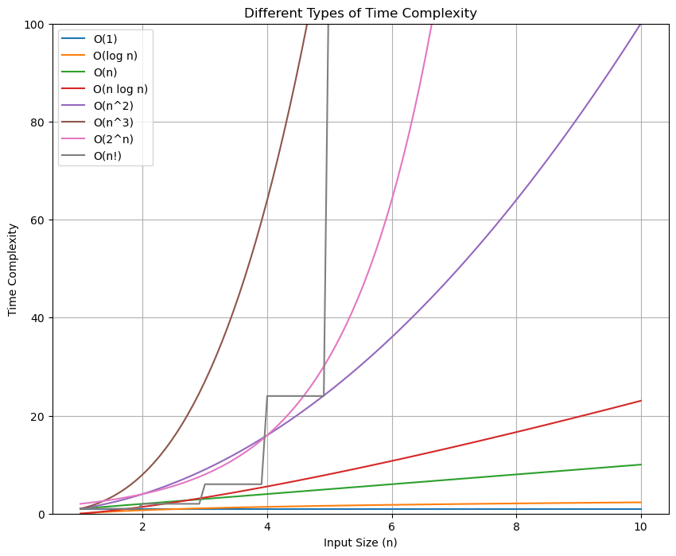

# DSA

- **O(1)**: Constant time, remains the same regardless of input size.
- **O(log n)**: Logarithmic time, grows slowly as input size increases.
- **O(n)**: Linear time, grows directly with input size.
- **O(n log n)**: Linearithmic time, grows faster than linear but slower than quadratic.
- **O(n^2)**: Quadratic time, grows quadratically with input size.
- **O(n^3)**: Cubic time, grows cubically with input size.
- **O(2^n)**: Exponential time, grows very quickly, doubling with each additional element.
- **O(n!)**: Factorial time, grows extremely fast, factorially with input size.

